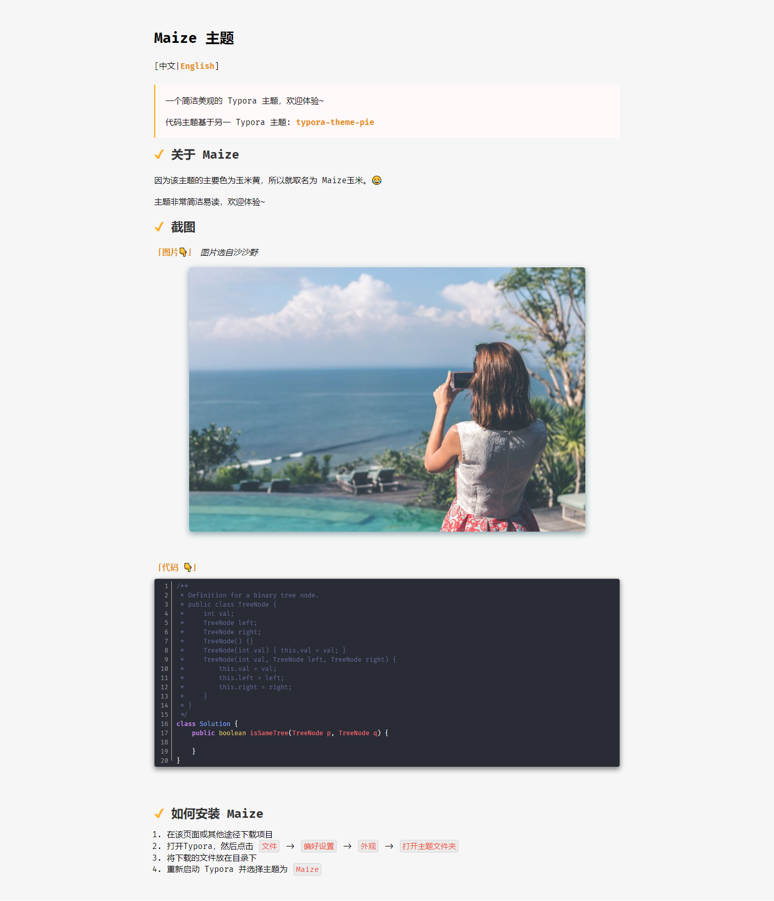

# Maize 主题

欢迎大家提出 `Issue` 以及 `Pull request`

\[中文|[English](./README_EN.md)]

> 一个简洁美观的 Typora 主题，欢迎体验~
>
> 代码主题基于另一 Typora 主题: [typora-theme-pie](https://github.com/kevinzhao2233/typora-theme-pie)

## 关于 Maize

因为该主题的主要色为玉米黄，所以就取名为 Maize玉米。😂

主题非常简洁易读，欢迎体验~

## 截图

## 如何安装 Maize

  1. 在该页面或其他途径下载项目

  2. 打开Typora，然后点击 `文件` -> `偏好设置` -> `外观` -> `打开主题文件夹` 

  3. 将下载的文件放在目录下

  4. 重新启动 Typora 并选择主题为 `Maize`

