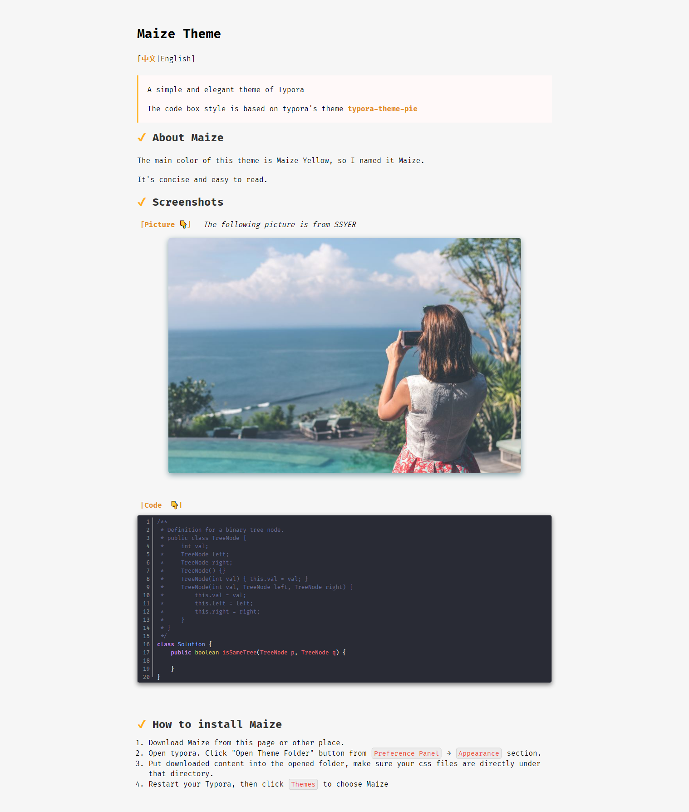

# Maize Theme

\[[中文](./README_ZH.md)|English]

> A simple and elegant theme of Typora
>
> The code box style is based on typora's theme [typora-theme-pie](https://github.com/kevinzhao2233/typora-theme-pie)

## About Maize

The main color of this theme is Maize Yellow, so I named it Maize.

It's concise and easy to read.

## Screenshots

## How to install Maize

  1. Download Maize from this page or other place.

  2. Open typora. Click "Open Theme Folder" button from `Preference Panel` → `Appearance` section.

  3. Put downloaded content into the opened folder, make sure your css files are directly under that directory.

  4. Restart your Typora, then click `Themes` to choose Maize

